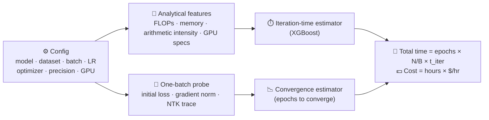

# 🕒 CHRONOS: Predicting Training Time and Convergence in Deep Learning

<p align="center">
  
</p>
<p align="center" style="font-size: 11px;">
  [This logo was generated using DALL·E 3 by OpenAI]
</p>

<p align="center">
  
  
  <a href="./LICENSE"></a>
  
</p>

<p align="center"><b>Know how long training will take, and what it will cost, <i>before</i> you start.</b></p>

---

## ⚡ TL;DR

- **Input:** a model, dataset, hyperparameters and a GPU.
- **Output:** seconds per epoch, epochs to converge, total hours and dollars.
- **How:** analytical compute features + a **one-mini-batch probe** at initialization. No training run needed.
- **How well:** **13.7% MAPE** on iteration time and **22.1% MAPE** on convergence, across 9 architectures and 10 GPUs.

---

## 🧠 How it works



Both estimators are trained once, offline. A new prediction only needs the probe: **one forward and one backward pass, with no optimizer step**.

---

## 📊 Results at a glance

| What | CHRONOS | Compared to |
|:--|:--|:--|
| ⏱️ Iteration-time error | **13.7% MAPE** | 27–60% lower RMSE than [PreNeT](https://github.com/pacslab/PreNeT) |
| 📉 Convergence error | **22.1% MAPE** | NTK-guided baseline 27.4%, scaling-law baseline 47.8% |
| 🧪 Unseen model / dataset / GPU | Beats PreNeT in **23 of 23** held-out groups | Average RMSE reduction of **50%** |

---

## 🤯 Fun facts from the paper

- 🔬 **The probe costs less than 0.3% of one epoch.** On CIFAR-scale data with batch 128, it is 1 mini-batch out of 391.
- 💻 **No GPU needed to predict.** The probe falls back to CPU, so you can estimate H100 runtimes from a laptop.
- 🎮 **A gaming GPU won.** For ViT on CIFAR-100, a consumer RTX 5090 trained faster and cheaper than an A100, V100 and L40S.
- 💸 **The cheapest GPU per hour is not the cheapest run.** For ResNet-50 on TinyImageNet, the T4 has the lowest hourly price, but the A40 was cheaper to actually reach convergence.
- 🐢 **Pricier is not always faster.** In the same experiment, the V100 run was the most expensive and one of the slowest.
- 🧪 **Bigger probes are not better.** For most CNNs and Transformers, the *smallest* probe batch gave the best convergence predictions.
- 📉 **The probe really matters.** Removing it raises convergence error from 22.1% to 31.7%.
- 📝 **It works beyond vision.** It reaches 6.2% iteration-time MAPE on LSTM, GRU, BiLSTM and GNMT text workloads.
- 🔋 **Built from about 480 GPU hours** of sweeps on Google Cloud and RunPod, so you don't have to repeat them.

---

## 📦 Installation

Requires **Python 3.11**.

```bash
git clone https://github.com/pacslab/chronos.git
cd chronos
pip install -e .
```

> 💡 On first use, CHRONOS downloads its pretrained regressors to `chronos/models/` and the probe dataset to `./data/`.
>
> 🍎 On macOS with the python.org installer, a `CERTIFICATE_VERIFY_FAILED` error during the dataset download means Python's certificates aren't installed. Run `/Applications/Python\ 3.11/Install\ Certificates.command` once to fix it.

---

## 🧩 Quick start

```python
import chronos

predictor = chronos.TrainingTimePredictor(model=chronos.Models.VGG16,
                                          dataset=chronos.Datasets.Cifar100,
                                          optimizer=chronos.Optimizers.SGD,
                                          batch_size=32,
                                          learning_rate=0.001,
                                          precision=16,
                                          gpu=chronos.Devices.T4)

epoch_time = predictor.predict_epoch_time()            # seconds per epoch
epochs = predictor.predict_number_of_epochs()          # epochs to converge
hours = epoch_time * epochs / 3600
cost = hours * chronos.Devices.T4.specs["$/hr"]        # USD, on-demand price

print(f"Epoch time: {epoch_time:.2f} s")
print(f"Epochs to converge: {epochs:.1f}")
print(f"Total: {hours:.2f} h  (~${cost:.2f})")
```

### ✅ Example output

```text
Predictor configured for: VGG16 on T4
Optimizer: SGD, Dataset: CIFAR100
Files already downloaded and verified
Epoch time: 251.29 s
Epochs to converge: 21.0
Total: 1.46 h  (~$0.41)
```

---

## 🗂️ What's supported

The bundled predictors were trained on these combinations.

| Family | Models | Datasets | Optimizers |
|:--|:--|:--|:--|
| 🧱 CNN | ResNet-50, VGG-16, MobileNetV2, DenseNet-121 | CIFAR-10, CIFAR-100, TinyImageNet, STL-10 | SGD, AdamW |
| 🔀 Token-mixing MLP | MLP-Mixer, ResMLP, AS-MLP | CIFAR-100, TinyImageNet, STL-10 | SGD, AdamW |
| 🤖 Transformer | ViT, DeiT-Tiny, DistilBERT | CIFAR-100, TinyImageNet, STL-10, SST-2, IMDB | Adam, AdamW, Adafactor |

**GPUs (10):** H100 · A100 · L40S · RTX 5090 · A40 · L4 · V100 · T4 · P100 · P4

**Precision:** FP16 and FP32

---

## 🔁 Reproduce the paper

| Folder | What it does |
|:--|:--|
| `epoch_time_collection/` | Benchmarks per-batch training time on your GPU (5 warm-up and 20 measured batches) |
| `epoch_time_prediction/` | Trains and evaluates the iteration-time model (random split, LODO, LOMO) |
| `epoch_convergence_prediction/` | Trains and evaluates the epochs-to-convergence model from probe features |

The `data/` folders hold the paper's meta-datasets: **10,680 timing measurements** and **324 full training runs to convergence**.

```bash
# Collect timings on your own GPU (writes CSVs to ./logs)
cd epoch_time_collection && python CNN.py --models resnet50 vgg16 --batch-sizes 32 64
```

```bash
# Train and evaluate the iteration-time predictor
cd epoch_time_prediction && python CNN.py
```

```bash
# Train and evaluate the convergence predictor
cd epoch_convergence_prediction && python CNN.py
```

Each folder has `CNN.py`, `MLP.py` and `Transformer.py`. Run them from inside the folder, because they read `./data/*.csv`.

---

## ⚠️ Scope

CHRONOS targets **single-GPU, full training from scratch**. It does not cover LLMs, distributed or multi-GPU training, or fine-tuning methods such as LoRA. Treat its numbers as a planning aid and leave some budget margin.

---

## 📘 Citation

If you find CHRONOS useful, please cite:

```bibtex
@article{pourali2026chronos,
  title   = {Chronos: A Unified Framework for Predicting Training Time and Convergence in Deep Learning},
  author  = {Pourali, Alireza and Boukani, Arian and Khazaei, Hamzeh},
  journal = {Transactions on Machine Learning Research},
  issn    = {2835-8856},
  year    = {2026}
}
```

Related work from our lab: [**PreNeT**](https://github.com/pacslab/PreNeT) (ICPE 2025), which predicts layer-level training time.

---

## ⚖️ License

Released under the [MIT License](./LICENSE). © 2026 PACS Lab.
